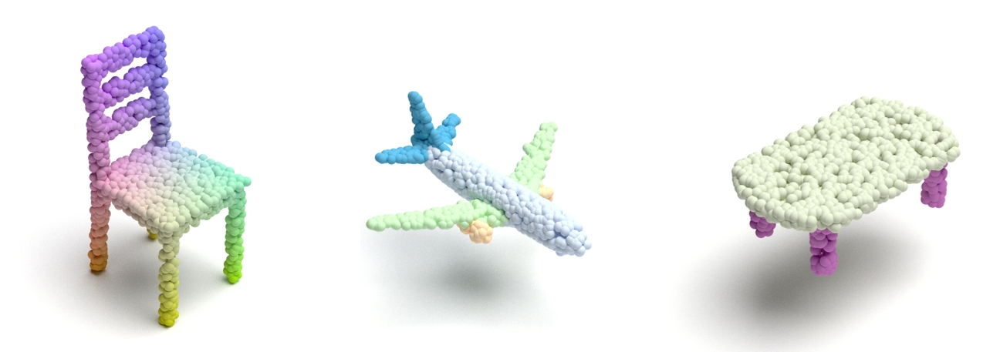

# Point Cloud Renderer Using Mitsuba3



# Preparation
```shell
pip install -r requirements.txt
```
<!-- # # note that the openexr-python should be installed by conda
# conda install -c conda-forge openexr-python -->

# Preliminary

* `point cloud format`：the extension can be `npy、npz、txt` (saved by numpy), storing a list of [x,y,z,...]. 
* `coordinate definition`: 
  * `left`: x
  * `up`: z
  * `screen facing out`: y

# Single image rendering
## 1. render a point cloud with default color setting
```shell
python main.py --file ./demo/chair_1024_pts.txt --sample 1024
```
`arguments:`
* `--file`: path to input point cloud
* `--sample`: the number of points to be sampled for rendering.
besides, you can modify the config file `config.yaml` to adjust the size of images or other parameters of the renderer.

## 2. render a point cloud with attention map
```shell
python main_attn.py --file ./vis_attn/case_1/position_1024_pts.txt --attn_map \
./vis_attn/case_1/attn_1024_pts.txt --attn_num 0 --sample 1024
```
`arguments:`
* `--file`: path to input point cloud
* `--attn_map`: path to attention map
* `--attn_num`: the order of attention map to visualize
* `--sample`: the number of points to be sampled for rendering.

## 3. render a point cloud with color
```shell
# render a point cloud which saved in .ply format with color
python main_color.py --file ./demo/0001_gt.ply --sample 2048
```
`arguments:`
* `--file`: path to input point cloud, the extension should be `.ply`, which can contains color information.
* `--sample`: the number of points to be sampled for rendering.

# Further development
1. The official reference link is given inline the code about scene definition. 
2. Edit the scene: [ref](git@github.com:OuyangJunyuan/PointCloudRenderer.git)
3. For more properties of plugins please refer this [link](https://mitsuba.readthedocs.io/en/stable/src/rendering_tutorials.html).

# Acknowledge

This script deeply based on [Mitsuba2PointCloudRenderer](https://github.com/tolgabirdal/Mitsuba2PointCloudRenderer) and [PointFlowRenderer](https://github.com/zekunhao1995/PointFlowRenderer) and is an easy-to-use version, which uses the Mitsuba3.